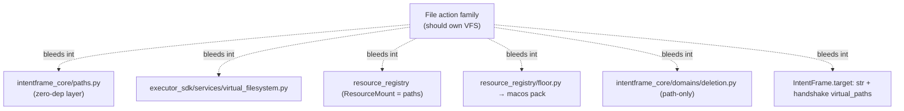

You're right — and that's a genuinely sharp observation. **VFS/virtual paths are file-family specifics, but the abstraction is "file-shaped" and that shape leaks into several layers that claim to be family-agnostic.** Here's exactly where it bleeds.

## The claim vs. reality

The architecture *says* there's a clean split: substrate is action-agnostic, families own their specifics (`docs/dev/action-family-wiring.md` even forbids `actions/<A>` importing `actions/<B>`). But the **path/VFS vocabulary predates that discipline and sits underneath it**, so it shows up in agnostic layers.

## Bleed point 1 — `intentframe_core` (the zero-dependency layer)

`intentframe_core` is documented as *"shared types and enums… zero dependencies on the rest of IntentFrame."* Yet it ships a file-family primitive and re-exports it at top level:

```9:9:intentframe_core/__init__.py
from intentframe_core.paths import VIRTUAL_HOME, normalize_virtual_path
```

`normalize_virtual_path` only matters to `READ_FILE`/`WRITE_FILE`/`LIST_DIRECTORY`/`DELETE_FILE`/`APPEND_ROW`. A `SEND_EMAIL` or `PAY_INVOICE` intent never touches it. So a file-family concept lives in the most universal package in the repo — that's the bleed your earlier question circled.

## Bleed point 2 — `executor_sdk/services/` (peer to truly-generic services)

The SDK services folder mixes genuinely action-agnostic infrastructure with one file-shaped service:

| Service | Agnostic? |
|---|---|
| `audit_logger.py`, `hash_chain.py` | yes — every action |
| `credential_vault.py`, `credential_scrubber.py` | yes — every action |
| `state_store.py` | yes — rollback for any action |
| `virtual_filesystem.py` | **no — file family only** |

`VirtualFileSystem` is presented as a first-class SDK service, but `SEND_EMAIL` never resolves a mount. It's a file concern wearing a generic-service uniform.

## Bleed point 3 — the "resource" registry is really a *file* registry

`resource_registry` is named as if it abstracts any resource, but its entire model is virtual→real **path** mapping:

```24:38:resource_registry/models.py
class ResourceMount(BaseModel):
    ...
    virtual_path: str
    real_path: str
    writable: bool = False
    file_filter: str | None = None
```

`ClientView` is literally `virtual_paths: list[str]`. There's no `EmailResourceMount` or `CalendarResource`. The "third registry" in `docs/registries.md` is, in practice, the file-mount table.

## Bleed point 4 — the most concrete code-level bleed: `floor.py` reaching into a macOS pack

This is the cross-layer leak that's actually acknowledged in a comment. `resource_registry/floor.py` imports *up* into a platform executor pack:

```70:70:resource_registry/floor.py
from intentframe_executor_pack_macos.sandbox.venv import owner_home
```

The docstring flags it as debt:

```64:69:resource_registry/floor.py
# Identity-aware HOME resolution lives in intentframe_executor_pack_macos.sandbox.venv today.
# ...  If the resource-registry is ever
# extracted as a microservice, lift owner_home() to a neutral location
# (intentframe_core.identity) and update both sides in one go.
```

So a registry that claims *"independent of… the executor package"* (its own module docstring) imports from a macOS executor pack for path/HOME math. That's path-vocabulary bleeding **across three layers at once** (registry → executor pack → OS identity).

## Bleed point 5 — into the *domain* layer

You saw this in the first question. The deletion domain is path-shaped, so non-file destructive actions don't fit the abstraction:

```9:15:intentframe_core/domains/deletion.py
Current limitation:
    This schema is still path-oriented. It works well for file deletions, but
    non-file destructive actions such as ``DELETE_EVENT`` and
    ``DELETE_REMINDER`` do not naturally have a ``path``. If those actions are
    mapped into the deletion domain without supplying a compatible payload,
    schema validation rejects them before policy enforcement runs.
```

And `action_registry/types.py` has `DELETE_EVENT`/`DELETE_REMINDER` **commented out** of `ACTION_DOMAINS` precisely because the path-shaped deletion schema can't represent them. The file vocabulary constrains the taxonomy.

## Bleed point 6 — into the universal `IntentFrame` and handshake

`IntentFrame.target: str` is a single string — natural for a path, awkward for everything else (which is why `data` exists as the real authority). And the handshake ships `ClientView.virtual_paths` to *every* agent via `RuntimeContext`, regardless of whether it does file work.

## So where does it bleed? — summary



## Why it bleeds (the honest reason)

Two forces:

1. **The pipeline and the executor must agree on canonical path form** *before* execution, so the primitive can't live only in the executor — it has to sit somewhere both import. The "shared" spot they chose was `intentframe_core`, which is why a file concept landed in the universal layer.
2. **VFS predates the bundle/substrate refactor.** Path virtualization was foundational (it's "7 of 10 safety properties" in `docs/executor/why-foundation.md`) and was built before the "families own their specifics" discipline existed. So it's grandfathered into the substrate rather than pushed down into the files bundle.

The cleaner end-state the code itself gestures at: move identity/path canonicalization to a neutral `intentframe_core.identity`, treat VFS as a files-bundle-owned capability the executor resolves, and generalize the deletion domain off `path`. Until then, **VFS is a file-family concern that the substrate carries on its behalf** — which is precisely the bleed you're sensing.