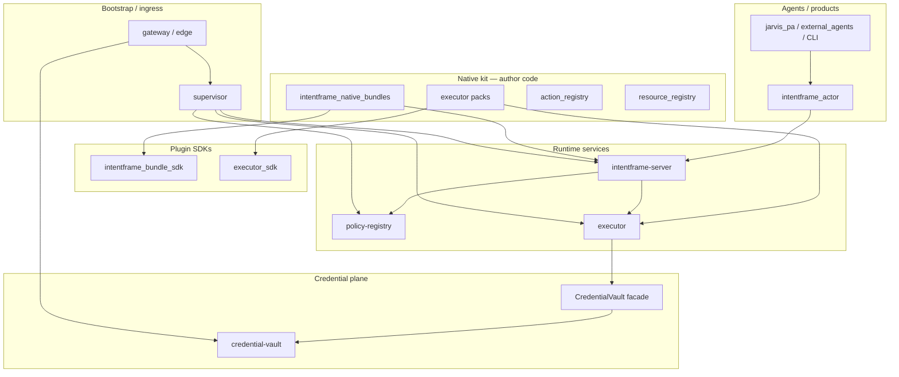

# Workspace Modules — A Map

> Every tracked module in the IntentFrame repository: hierarchy, role, and where to read more.

Use this page to find modules and understand how they relate. For system behavior, start with [README.md](README.md) and [architecture.md](architecture.md). For process startup, see [processes.md](processes.md).

---

## Vocabulary

The same word often means different things in different layers. Use these qualifiers:

| Term | Meaning in this repo |
|------|----------------------|
| **Framework / SDK** | Libraries plugin authors implement against — not running services |
| **Runtime** | Long-lived processes started by supervisor or gateway bootstrap |
| **Substrate** | Pipeline + policy + executor host; must not import plugin implementation code |
| **Credential plane** | `intentframe_credentials` vault service + `CredentialVault` consumer interface; executor is wired to this today through `executor_sdk.services.credential_vault` |
| **Native kit** | First-party plugin author code under `intentframe_native_kit/` — replaceable like a third-party product would ship |
| **`intentframe_core` package** | Internal neutral DTOs (`IntentFrame`, `Decision`, …); substrate and SDKs import it; **plugins do not** |
| **`intentframe-server` service** | Supervisor process name for the pipeline (log: `intentframe-server.log`); implemented by the `intentframe-server` package (`intentframe_server` + `intentframe_components`); **no `intentframe-server/` folder at repo root** |
| **`core.yaml` profile** | Config file listing `bundles:` for the pipeline service (`INTENTFRAME_CORE_CONFIG`) — not the types package |
| **`intentframe-runtime`** | Pip meta-package: `intentframe-policy-registry` + `intentframe-executor` + `intentframe-server` (no code) |
| **`intentframe-supervisor`** | Process manager + `intentframe` / `intentframe-backend` scripts; depends on `intentframe-runtime` |
| **`intentframe-supervisor[native]`** | Adds `intentframe-native-kit` so the 4-service kit profile can run (config-only; supervisor does not auto-detect) |

---

## Installable runtime stack (pip)

```text
intentframe-supervisor[native]     # product / demo / gateway substrate
├── intentframe-supervisor         # spawns uvicorn children from YAML graph
│   └── intentframe-runtime        # pulls policy-registry, executor, intentframe-server
└── [native] intentframe-native-kit   # resource-registry module + kit YAML profiles
```

Base supervisor default graph: `packages/intentframe-supervisor/supervisor/config/supervisor.yaml` (3 services, no resource-registry). Kit graph: `intentframe_native_kit/supervisor_profile.yaml` on the installed package — select via `--config` or `INTENTFRAME_SUPERVISOR_CONFIG` (see [demo/README.md](../demo/README.md) for the `KIT=…` resolver).

---

## Hierarchy (what exists today)

Modules group into layers by responsibility: author-facing contracts, plugin code, runtime services, credential plane, bootstrap/ingress, and optional platform bridges.

```
┌─────────────────────────────────────────────────────────────────┐
│  Agents / products (optional)                                   │
│  jarvis_pa, jarvis_telegram, external_agents, intentframe_cli,  │
│  intentframe_dashboard                                          │
└───────────────────────────────┬─────────────────────────────────┘
                                │ intentframe_actor (Agent SDK)
┌───────────────────────────────▼─────────────────────────────────┐
│  Plugin author code (first-party example: intentframe_native_kit)│
│  action_registry, intentframe_native_bundles, executor packs,    │
│  resource_registry, kit YAML profiles                            │
└───────────────────────────────┬─────────────────────────────────┘
                                │ intentframe_bundle_sdk, executor_sdk
┌───────────────────────────────▼─────────────────────────────────┐
│  Substrate runtime (supervisor default graph)                   │
│  policy-registry │ intentframe-server │ executor                  │
└───────────────────────────────┬─────────────────────────────────┘
                                │ intentframe_core, prompt_library,
                                │ command_shield (libraries)
┌───────────────────────────────▼─────────────────────────────────┐
│  Credential plane (runtime dependency today)                    │
│  credential-vault service + executor CredentialVault facade     │
└───────────────────────────────┬─────────────────────────────────┘
                                │
┌───────────────────────────────▼─────────────────────────────────┐
│  Bootstrap / ingress (convenience; replaceable)                 │
│  intentframe-supervisor, gateway (root), intentframe-edge,     │
│  intentframe-proxy (edge → proxy dep)                           │
└───────────────────────────────┬─────────────────────────────────┘
                                │
┌───────────────────────────────▼─────────────────────────────────┐
│  Platform bridges (optional per deployment)                     │
│  external_data_ingestion, macos-appkit-server                   │
└─────────────────────────────────────────────────────────────────┘
```



---

## Module groups

### 1. Plugin frameworks (author import surface)

What you implement against when writing bundles, packs, or agents.

| Module | Role | Process |
|--------|------|---------|
| [`intentframe_bundle_sdk/`](../../packages/intentframe-bundle-sdk/intentframe_bundle_sdk/) | Action/domain bundle contract: hooks, `DeterministicRunner`, loader, registry. Re-exports wire types (`IntentFrame`, `DomainSchema`, `normalize_virtual_path`, …) so plugins need not import `intentframe_core`. | Library |
| [`executor_sdk/`](../executor_sdk/) | Executor pack contract: ABCs + `register_*` registries for adapters and (optionally) platform backends; wire models; credential vault facade. **`executor/` is also a consumer** — factories and gateway helpers live in the SDK today. See [executor_sdk/README.md](../executor_sdk/README.md). | Library |
| [`intentframe_actor/`](../../packages/intentframe-actor/intentframe_actor/) | Agent SDK — `Actor` submits intents to the pipeline over UDS/HTTP. | Runs in agent process |

Docs: [`intentframe_bundle_sdk/README.md`](../../packages/intentframe-bundle-sdk/README.md), [`executor_sdk/README.md`](../../packages/executor-sdk/README.md), [plugin-profiles.md](plugin-profiles.md), [actor-sdk.md](actor-sdk.md).

### 2. Internal shared libraries (substrate + SDK deps)

Not the plugin author surface. `intentframe_core` stays internal; SDKs re-export what plugins need.

| Module | Role | Process |
|--------|------|---------|
| [`intentframe_core/`](../../packages/intentframe-core/intentframe_core/) | Neutral DTOs and enums. `IntentFrame.action` is a plain `str`. | Library |
| [`intentframe_prompt_library/`](../../packages/intentframe-prompt-library/intentframe_prompt_library/) | Default AE/Guardian prompt bodies shared by substrate and bundles. | Library |
| [`command_shield/`](../../packages/command-shield/command_shield/) | Deterministic shell/code inspector — **fact producer**, not a policy engine. Used by pipeline, bundles, and adapters. | Library |
| [`executor_client/`](../../packages/executor-client/executor_client/) | Client + wire models for core → executor over UDS. | Library |
| [`intentframe_client/`](../../packages/intentframe-client/intentframe_client/) | HTTP/UDS client for agents and tools → intentframe-server (`/handshake`, `/process`, `/audit`). Used by Actor and dashboard; not part of the server process. | Library |

### 3. Substrate runtime (minimal supervisor graph)

Default [`supervisor/config/supervisor.yaml`](../../packages/intentframe-supervisor/supervisor/config/supervisor.yaml): `policy-registry`, `executor`, `intentframe-server`. Kit profile adds `resource-registry`.

| Module | Service name | Role |
|--------|--------------|------|
| [`policy_registry/`](../../packages/policy-registry/policy_registry/) | `policy-registry` | User policies (opaque constraint dicts). Configuration plane. |
| [`intentframe_server/`](../../packages/intentframe-server/intentframe_server/) + [`intentframe_components/`](../../packages/intentframe-components/intentframe_components/) | **`intentframe-server`** | Pipeline: DG → AE → Guardian → forward to executor. Loads bundles from `core.yaml`. |
| [`executor/`](../../packages/executor/executor/) | `executor` | Only process that performs real I/O; loads packs from `executor.yaml`; its internal `ExecutorGateway` owns a `CredentialVault` instance for adapter secrets. |

Docs: [processes.md](processes.md), [architecture.md](architecture.md), [executor.md](executor.md).

### 4. Credential plane (runtime dependency today)

The credential vault is not just launcher convenience. In the normal runtime, `executor.yaml` selects `credentials.backend: service`; executor startup calls `executor_sdk.services.credential_vault.create_credential_vault()`, which constructs a `ServiceVault` backed by `intentframe_credentials.VaultClient`. The executor gateway then fetches adapter credentials from the vault service over UDS before calling adapters.

| Module | Service / role | Notes |
|--------|----------------|-------|
| [`intentframe_credentials/`](../packages/intentframe-credentials/intentframe_credentials/) | `credential-vault` (`intentframe-credentials` package) | Process on `credential-vault.sock`; stores secrets in keyring / HashiCorp / env backend depending on `IF_VAULT_BACKEND`. |
| [`executor_sdk/services/credential_vault.py`](../../packages/executor-sdk/executor_sdk/services/credential_vault.py) | Consumer facade | Imports and re-exports the `intentframe_credentials` backends (`service`, `keyring`, `hashicorp`, `env`) for executor config and pack registration. |
| [`executor/gateway.py`](../../packages/executor/executor/gateway.py) | Credential consumer | Fetches `api_key` / `credential` for adapters that declare `requires_credentials=True`. |

Important split: `IF_VAULT_BACKEND` configures where the vault **service** stores secrets; `executor.yaml` `credentials.backend` configures how the **executor** obtains a `CredentialVault` object. Normal deployments keep executor on `service`.

Docs: [credentials-vault.md](credentials-vault.md), [credential-vault-faq.md](credential-vault-faq.md).

### 5. Bootstrap and ingress (mostly convenience)

Generic orchestration — replaceable with Docker Compose, systemd, etc. No domain logic. The gateway is currently the product bootstrapper that starts the vault first, then starts supervisor with runtime env.

| Module | Service / role | Notes |
|--------|----------------|-------|
| [`supervisor/`](../../packages/intentframe-supervisor/supervisor/) | `supervisor` (`intentframe-supervisor` package) | Spawns uvicorn children from YAML graph; injects `runtime_env`. |
| [`intentframe_gateway/`](../intentframe_gateway/) | `intentframe-gateway-cli` | Product entry point; starts vault → supervisor → optional EDI/Jarvis. |
| [`intentframe_edge/`](../packages/intentframe-edge/intentframe_edge/) | `intentframe-edge` (`intentframe-edge` package) | HTTP/TLS ingress; default routes: `/policies`, `/handshake`, `/process`, `/audit`. |
| [`intentframe_proxy/`](../packages/intentframe-proxy/intentframe_proxy/) | `intentframe-proxy` package | Shared UDS proxy helper for gateway and edge. |

### 6. Platform bridges (optional)

| Module | Service | Role |
|--------|---------|------|
| [`external_data_ingestion/`](../external_data_ingestion/) | `email-sync-daemon` | IMAP/SMTP + local mail mirror; used by mail adapters and Jarvis. |
| [`macos-appkit-server/`](../macos-appkit-server/) | `macos-appkit-server` | Swift bridge for Apple frameworks (TCC-stable binary). |

### 7. Native kit — first-party plugin author code

**Not substrate.** A third party would ship an equivalent tree for their product (e.g. Jarvus). See [`intentframe_native_kit/README.md`](../packages/intentframe-native-kit/intentframe_native_kit/README.md).

| Path | Role |
|------|------|
| `intentframe_native_kit/action_registry/` | Kit-local action vocabulary (`ActionType`, catalog, domain schemas). Optional for agents. |
| `intentframe_native_kit/intentframe_native_bundles/` | Action + domain bundles; `register_bundles` entry point. |
| `intentframe_native_kit/intentframe_executor_pack_posix/` | Base pack: transport, auth, storage, files adapter. |
| `intentframe_native_kit/intentframe_executor_pack_macos/` | macOS adapters + terminal sandbox. |
| `intentframe_native_kit/intentframe_executor_pack_console/` | Console `user_io`. |
| `intentframe_native_kit/resource_registry/` | Optional workspace/mount service (kit supervisor profile). |
| `intentframe_native_kit/*.yaml` | First-party profiles: `core.yaml`, `supervisor_profile.yaml`, `edge_profile.yaml`. |

**Kit imports from workspace today:** `intentframe_bundle_sdk`, `executor_sdk`, `command_shield`, `external_data_ingestion` (lazy in email/mail), and kit-internal modules. Kit does **not** import `intentframe_core`, `intentframe_server`, or `policy_registry`. In-process demo glue (`ExecutorBridge`) lives in `tests/_bridge.py` — test-only, not kit substrate.

### 8. Agents and frontends

| Module | Role |
|--------|------|
| [`jarvis_pa/`](../jarvis_pa/) | Reference macOS assistant; uses Actor SDK only toward IntentFrame. |
| [`jarvis_telegram/`](../jarvis_telegram/) | Telegram bridge to Jarvis. |
| [`external_agents/`](../external_agents/) | Third-party agent examples (`invoice_bot`, `return_agent`). |
| [`intentframe_cli/`](../intentframe_cli/) | Terminal REPL frontend → gateway socket. |
| [`intentframe_dashboard/`](../intentframe_dashboard/) | Programmatic admin / demo control plane. |

---

## Import boundaries (CI-enforced)

Direction matters: **substrate must not look down into plugins**; **plugins import SDKs, not `intentframe_core`**.

| Rule | Enforced in |
|------|-------------|
| `intentframe_server`, `intentframe_bundle_sdk`, `intentframe_components` must not import `intentframe_native_kit.intentframe_native_bundles` | `tests/test_boundary_imports.py` |
| `executor/` must not import `intentframe_native_kit` | `tests/test_executor_boundary_imports.py` |
| Executor packs must not import action bundles | `tests/test_executor_boundary_imports.py` |
| `intentframe_native_kit/` must not import `intentframe_core` | `tests/test_native_kit_boundary_imports.py` |
| No cross-bundle imports under `actions/<A>/` → `actions/<B>/` | `tests/test_boundary_imports.py` |

**Author import cheat sheet:**

```python
# Bundle / domain plugin
from intentframe_bundle_sdk import ActionBundle, IntentFrame, DomainSchema

# Executor pack — adapter author (typical third-party)
from executor_sdk.adapters.base import CapabilityAdapter
from executor_sdk.adapters import register_adapter
from executor_sdk.models import AdapterManifest, ExecutionResult

# Executor pack — platform base (transport/auth/storage; e.g. posix pack)
from executor_sdk.transport import register_transport
from executor_sdk.auth import register_auth_verifier
from executor_sdk.services.audit_logger import register_audit_logger
from executor_sdk.services.state_store import register_state_store
from executor_sdk import owner_home

# Agent
from intentframe_actor import Actor
```

Packs must **not** import `executor/` or `intentframe_core`. Platform packs call `register_*`; the host calls `create_*` at startup.

---

## Layering: types, taxonomy, and pipeline

```
intentframe_core              internal DTOs (IntentFrame.action is str)
       ▲
       │  re-exported by
intentframe_bundle_sdk        plugin-facing wire types + bundle contract
       ▲
       │  implements
intentframe_native_bundles    (or your third-party bundle package)

intentframe_native_kit.action_registry   kit-local ActionType / catalog (optional for agents)
       ▲
       │  optional fail-fast
agent tools (Jarvis, …)       may import action_registry; Actor SDK does not require it
```

Substrate (`intentframe_server`, `intentframe_components`) orchestrates the pipeline and consumes `BundleAIContext` from the SDK runner — it does not dispatch into per-family checkers or import bundle modules.

### Executor: host, SDK, and packs

The executor has **no built-in packs**. `executor.yaml` must list at least one pack (typically `intentframe_executor_pack_posix` for transport/auth/storage, plus adapter packs). Empty `packs:` fails closed at startup.

Three roles — do not collapse them:

| Role | Implements | Typical importer |
|------|------------|------------------|
| **Adapter author** | `CapabilityAdapter` + `register_adapter` | Third-party capability packs |
| **Platform author** | `TransportServer`, `AuthVerifier`, `AuditLogger`, `StateStore`, … + matching `register_*` | Base pack (posix) or custom deployment |
| **Executor host** | Gateway, dispatch, worker pool, `create_*` wiring | `executor/` only |

```
executor/                     host: gateway, load packs, create_* from registries
       ▲
       │  imports contracts + factories
executor_sdk/                 ABCs, wire models, register_* + create_* (today)
       ▲
       │  register_all() at startup
intentframe_executor_pack_*   adapters (+ optional platform backends)
```

**Trust model (today):** packs run in-process with full Python access. `register_*` is a wiring contract, not a sandbox. Org-trusted / first-party packs are the expected case; see [`TODO/executor_sdk_layering.md`](../TODO/executor_sdk_layering.md) for a future split (neutral contracts package + trimmed author SDK + host-owned registries).

**Minimum runnable stack:** posix platform pack + at least one adapter in `adapters.enabled`. Packs loaded with zero adapters boot but reject every action.

---

## Module reference

### `intentframe_core/`

| | |
|---|---|
| **What** | Shared types (`IntentFrame`, `Decision`, `ExecutionResult`, …), path helpers, `DomainSchema` base. |
| **Who imports** | Substrate, SDKs, tests — **not** native kit or third-party plugins directly. |
| **Process** | None (library). |

### `intentframe_bundle_sdk/`

| | |
|---|---|
| **What** | Bundle lifecycle contract + re-exported wire types for plugin authors. |
| **Who imports** | `intentframe_components`, `intentframe_server`, native bundles, third-party bundles. |
| **Process** | None (library). |
| **README** | [`intentframe_bundle_sdk/README.md`](../../packages/intentframe-bundle-sdk/README.md) |

### `executor_sdk/`

| | |
|---|---|
| **What** | Shared contract layer for the executor **host** and **packs**: wire models, ABCs, plugin registries (`register_*` / `create_*`), and the credential vault facade. Not the orchestration brain — that stays in `executor/gateway.py`. |
| **Nature** | Monolithic today: adapter contract, platform backend contract, and host startup helpers coexist in one package. That is acceptable while packs are org-trusted; most third-party work is **adapters only**, with posix supplying platform backends. |
| **Adapter author surface** | `CapabilityAdapter`, `register_adapter`, `AdapterManifest`, `ExecutionResult`; optional VFS helpers (`MountPointConfig`, `expand_path`) for file adapters. Adapters receive `(action, params, credentials)` — not `ExecutionRequest`. |
| **Platform author surface** | `TransportServer`, `AuthVerifier`, `AuditLogger`, `StateStore`, `VirtualFileSystem`, `CredentialVault` + matching `register_*`. Wire types: `ExecutionRequest`, `AuthorizationProof`, `AuditEntry`, … |
| **Host-only today (also in SDK)** | `create_*` factories, `CredentialScrubber`, `HashChain`, dispatch/gateway exceptions, config defaults. Consumed by `executor/`; pack authors should not need these for normal adapter work. |
| **Pack contract** | Module-level `register_all()` (idempotent; no registration on import). Discovery: `executor_sdk.packs.ENTRY_POINT_GROUP` → `"intentframe.executor_packs"`. |
| **Credential coupling** | `executor_sdk.services.credential_vault` imports `intentframe_credentials` backends and re-exports `CredentialVault`, `ServiceVault`, `KeyringVault`, `HashiCorpVault`, `EnvVault`, `register_credential_vault`, `create_credential_vault`. Backends self-register on import; normal runtime selects `service` via `executor.yaml`. |
| **Who imports** | `executor/` (host), native executor packs, third-party packs. Packs use this facade instead of `intentframe_credentials` or `executor/` directly. Re-exports `owner_home` from `intentframe_core.identity`. |
| **Process** | None (library). |
| **README** | [`executor_sdk/README.md`](../executor_sdk/README.md) |
| **Future** | [`TODO/executor_sdk_layering.md`](../TODO/executor_sdk_layering.md) — split neutral wire types, trimmed author SDK, host-owned registries/factories. |

### `intentframe_prompt_library/`

| | |
|---|---|
| **What** | Default Analysis Engine and Guardian prompt bodies. |
| **Who imports** | Substrate prompt assembly, bundles (family forks). |
| **Process** | None (library). |

### `policy_registry/`

| | |
|---|---|
| **What** | Stores user policies — allowed actions and opaque constraint dicts. |
| **Process** | `policy-registry` on `policy-registry.sock`. |
| **Docs** | [registries.md § Policy registry](registries.md#the-policy-registry) |

### `intentframe_server/` + `intentframe_components/`

| | |
|---|---|
| **What** | Pipeline runtime (`IntentFrameRuntime`), FastAPI app, AE/Guardian/onboarding. |
| **Process** | **`intentframe-server`** on `intentframe.sock`. |
| **Config** | `INTENTFRAME_CORE_CONFIG` → `core.yaml` with non-empty `bundles:`. |
| **Docs** | [plugin-profiles.md](plugin-profiles.md), [processes.md](processes.md) |

### `executor/`

| | |
|---|---|
| **What** | Executor host; loads packs; holds credentials; audit log. |
| **Process** | `executor` on `executor.sock`. |
| **Config** | `EXECUTOR_CONFIG` → `executor.yaml` with non-empty `packs:`. |
| **Credential path** | `executor.main.build_gateway()` creates a `CredentialVault` from `executor_sdk.services.credential_vault.create_credential_vault(config.credentials)`. With normal `credentials.backend: service`, the executor talks to `credential-vault.sock` through `ServiceVault`. |
| **README** | [`executor/README.md`](../../packages/executor/README.md) |

### `command_shield/`

| | |
|---|---|
| **What** | Deterministic command/code analysis (CATASTROPHIC / NEEDS_REVIEW / SAFE + capability tags). |
| **Why separate from substrate** | Shared library; consumers decide policy; not a running service. |
| **README** | [`command_shield/README.md`](../command_shield/README.md) |

### `intentframe_native_kit/`

| | |
|---|---|
| **What** | First-party plugins, taxonomy, optional resource-registry service, kit profiles. |
| **Why** | Reference integration — same shape a third-party product (Jarvus) would ship. |
| **README** | [`intentframe_native_kit/README.md`](../packages/intentframe-native-kit/intentframe_native_kit/README.md) |
| **Docs** | [plugin-profiles.md](plugin-profiles.md), [dev/action-family-wiring.md](dev/action-family-wiring.md) |

#### `intentframe_native_kit/action_registry/`

Static catalog of actions, categories, domain tags, and domain intent schemas. Pipeline uses opaque action strings; registry is for kit authors and optional agent pre-flight.

#### `intentframe_native_kit/resource_registry/`

Workspaces and mount tables; `ClientView` / `ExecutorView`. **Opt-in** — minimal supervisor default omits this service.

#### `intentframe_native_kit/intentframe_native_bundles/`

First-party `ActionBundle` / `DomainBundle` implementations. Loaded when listed in `core.yaml`.

### `intentframe-credentials` (`packages/intentframe-credentials/`)

| | |
|---|---|
| **What** | Shared credential system: vault service, `VaultClient`, backend registry, keyring/hashicorp/env/service backends, redaction helpers. |
| **Package** | [`packages/intentframe-credentials/`](../packages/intentframe-credentials/); distribution `intentframe-credentials`. |
| **Process** | `credential-vault` — started by gateway before supervisor. |
| **Who depends on it today** | Gateway starts it and gates startup on mandatory credentials; supervisor injects `runtime_env` credentials; executor reaches it through `executor_sdk.services.credential_vault` when `credentials.backend: service`; EDI calls it for IMAP/SMTP passwords. |
| **Docs** | [credentials-vault.md](credentials-vault.md), [credential-vault-faq.md](credential-vault-faq.md) |

### `intentframe-supervisor` (`packages/intentframe-supervisor/supervisor/`)

| | |
|---|---|
| **What** | Generic process manager: read YAML → spawn uvicorn → health-check → monitor. Service graph is **admin-owned data**, not supervisor logic. |
| **Package** | [`packages/intentframe-supervisor/`](../packages/intentframe-supervisor/); console scripts `intentframe`, `intentframe-backend`. |
| **Default graph** | `policy-registry`, `executor`, `intentframe-server`. |
| **Kit graph** | Adds `resource-registry` via `${KIT}/supervisor_profile.yaml` (with `KIT` resolved from the installed package). |

### `intentframe_gateway/`, `intentframe-edge`, `intentframe-proxy`

Gateway = product orchestrator and unified API socket. Edge = network ingress to substrate backends. Proxy = shared UDS forwarding.

### `intentframe_actor/`

Agent SDK — sole intended import for agent code talking to IntentFrame.

### `jarvis_pa/`, `jarvis_telegram/`, `external_agents/`

Product/agent code outside substrate; demonstrate Actor-only integration. `return_agent/` is a controlled experiment (hardened DIY returns chatbot vs IntentFrame on the same semantic refund rules) — see [evidence.md § Suite 4](evidence.md#suite-4-return-agent-experiment).

---

## Workspace layout vs. installable packages

**Root umbrella** (`intentframe` on `pyproject.toml`): gateway, CLI, dashboard, credentials, agents — depends on `intentframe-supervisor[native]` and the split workspace packages under `packages/`, including edge/proxy.

**Runtime stack** (workspace): `intentframe-runtime` → `intentframe-supervisor` → optional `[native]` → `intentframe-native-kit`. Substrate services live in `packages/intentframe-server`, `packages/executor`, `packages/policy-registry`, etc. Network ingress is `packages/intentframe-edge` (depends on `packages/intentframe-proxy`); the two-venv harness installs both into `.venv-runtime` and pins them in `runtime-constraints.txt`.

**Separate workspace members** (`[tool.uv.workspace]`): all `packages/*` (including `intentframe-credentials`) plus `jarvis_pa`, `jarvis_telegram`, `external_data_ingestion` — each with its own `pyproject.toml`. License split: AGPL runtime (executor, server, components, runtime, supervisor) vs Apache-2.0 SDKs, policy-registry, kit, ingress — see [licensing.md](licensing.md).

**Not Python packages:** `macos-appkit-server/` (Swift), `demo/`, `deploy/`, `docs/`, `tests/`, `scripts/`.

---

## Supporting directories (not modules)

| Directory | Purpose |
|-----------|---------|
| `demo/` | End-to-end demos and attack/benign intent suites |
| `tests/` | Cross-cutting integration and boundary import tests; in-process executor bridge (`tests/_bridge.py`) and pipeline coverage (`tests/test_executor.py`) |
| `deploy/` | Docker Compose for dev/prod |
| `scripts/`, `git-hooks/` | Developer tooling |
| `roadmap/`, `TODO/` | Planning artifacts |

---

## Coverage matrix

| Module | Module README | Dedicated public doc | Notes |
|--------|---------------|----------------------|-------|
| `intentframe_core` | — | [architecture.md](architecture.md) | Internal; plugins use SDK re-exports |
| `intentframe_bundle_sdk` | ✅ | [plugin-profiles.md](plugin-profiles.md) | Plugin author surface |
| `executor_sdk` | ✅ | [plugin-profiles.md](plugin-profiles.md), [executor.md](executor.md), [credential-vault-faq.md](credential-vault-faq.md) | Adapter + platform pack contract; host also imports factories today |
| `intentframe_prompt_library` | — | [architecture.md](architecture.md) | |
| `policy_registry` | — | [registries.md](registries.md) | |
| `intentframe_server` / `intentframe_components` | — | [architecture.md](architecture.md), [processes.md](processes.md) | = `intentframe-server` service |
| `executor` | ✅ | [executor.md](executor.md), [credentials-vault.md](credentials-vault.md) | Uses `CredentialVault`; normal backend is `service` over UDS to vault |
| `executor_client` | — | [architecture.md](architecture.md) | |
| `command_shield` | ✅ | [executor/security-model.md](executor/security-model.md) | Library, not runtime service |
| `intentframe_native_kit` | ✅ | [plugin-profiles.md](plugin-profiles.md) | Author code, not substrate |
| `intentframe_credentials` | ✅ | [credentials-vault.md](credentials-vault.md), [credential-vault-faq.md](credential-vault-faq.md) | Credential plane; gateway/vault/executor/EDI path |
| `external_data_ingestion` | ✅ | [email-sync.md](email-sync.md) | Workspace member |
| `macos-appkit-server` | ✅ | [macos-platform-server.md](macos-platform-server.md) | Swift |
| `intentframe_gateway` | ✅ | [processes.md](processes.md) | |
| `intentframe-supervisor` | ✅ | [processes.md](processes.md) | Process manager; `intentframe` / `intentframe-backend` scripts |
| `intentframe_edge` | ✅ | [deploy/prod/README.md](../deploy/prod/README.md) | `intentframe-edge` package |
| `intentframe_proxy` | ✅ | — | `intentframe-proxy` package; shared helper |
| `intentframe_cli` | ✅ | [quickstart.md](quickstart.md) | |
| `intentframe_dashboard` | — | [quickstart.md](quickstart.md) | |
| `intentframe_actor` | — | [actor-sdk.md](actor-sdk.md) | |
| `jarvis_pa` | ✅ | [jarvis.md](jarvis.md) | Workspace member |
| `jarvis_telegram` | ✅ | [jarvis-telegram.md](jarvis-telegram.md) | Workspace member |
| `external_agents` | — | [actor-sdk.md](actor-sdk.md) | |

---

## Related documents

- [README.md](README.md) — Docs index
- [architecture.md](architecture.md) — Logical pipeline
- [processes.md](processes.md) — Process tree and sockets
- [plugin-profiles.md](plugin-profiles.md) — `core.yaml`, `executor.yaml`, entry points
- [registries.md](registries.md) — Policy vs resource registry
- [credentials-vault.md](credentials-vault.md) — Vault service lifecycle and delivery modes
- [credential-vault-faq.md](credential-vault-faq.md) — Executor `CredentialVault`, backend registry, `service` backend, and `IF_VAULT_BACKEND`
- [intentframe_native_kit/README.md](../packages/intentframe-native-kit/intentframe_native_kit/README.md) — Kit layout and import rules
- [executor_sdk/README.md](../executor_sdk/README.md) — Executor pack roles, registration, import surface
- [TODO/executor_sdk_layering.md](../TODO/executor_sdk_layering.md) — Accepted monolith today; future contracts / host split
- [intentframe_bundle_sdk/README.md](../../packages/intentframe-bundle-sdk/README.md) — Bundle contract and plugin import surface
- [intentframe-runtime/README.md](../../packages/intentframe-runtime/README.md) — Runtime meta-package
- [intentframe-supervisor/README.md](../../packages/intentframe-supervisor/README.md) — Supervisor and console scripts
