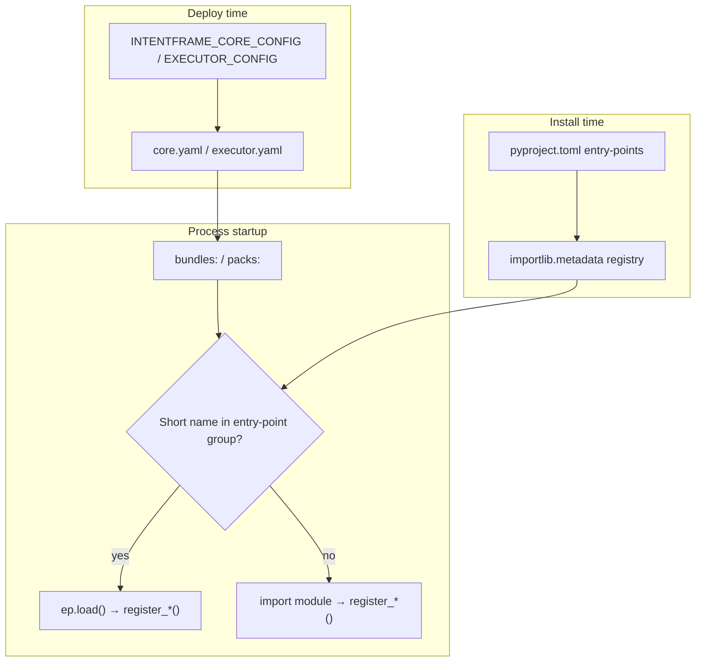

# Plugin profiles: core bundles and executor packs

> How IntentFrame loads third-party action bundles and executor packs at startup — YAML profiles, environment variables, and `pyproject.toml` entry points.

IntentFrame has two **plugin hosts** that behave the same way conceptually:

| Host process | Profile file | Env selector | List field | Registers |
|--------------|--------------|--------------|------------|-----------|
| **intentframe-core** | `core.yaml` | `INTENTFRAME_CORE_CONFIG` | `bundles:` | Action/domain bundles (Deterministic Guardian, policy validation) |
| **executor** | `executor.yaml` | `EXECUTOR_CONFIG` | `packs:` | Transports, auth, storage, capability adapters |

Nothing loads from `pyproject.toml` by itself. Entry points are a **discovery registry**; the profile YAML is the **explicit allowlist**. If a bundle or pack is not listed in the active profile, it does not run.

The supervisor and gateway **forward profile paths** (`INTENTFRAME_CORE_CONFIG`, `EXECUTOR_CONFIG`). They do not interpret `bundles:` or `packs:`.

---

## End-to-end flow



1. **Ship** entry points in your wheel (optional short names).
2. **Ship** a profile YAML listing what to load.
3. **Point** the process at that YAML via env (or pass a path in tests).

---

## Profile files and environment variables

### intentframe-core (`core.yaml`)

| Field | Purpose |
|-------|---------|
| `bundles:` | **Required.** Non-empty list of bundle refs to load at startup. |
| `executor.mode` | `real` (UDS to executor) or `dry_run` (in-process synthetic executor). |
| `executor.socket_path` | UDS path when `mode: real`. |
| `executor.dry_run_context` | Optional label for dry-run demos (e.g. `root`). |
| `runtime.verbose` | Pipeline logging. |
| `runtime.skip_onboarding` | Skip onboarding engine when true. |
| `bundle_options:` | Reserved mapping shape for future bundle-owned options (validated as a dict only today). |

**Selector:** `INTENTFRAME_CORE_CONFIG` must point at a readable `core.yaml` when starting core directly (tests, supervisor child). There is **no** `INTENTFRAME_BUNDLES` env shortcut — same strictness as executor has for packs.

**Legacy overrides** (applied after YAML parse): `INTENTFRAME_EXECUTOR_MODE`, `INTENTFRAME_EXECUTOR_SOCKET`, `INTENTFRAME_DRY_RUN_CONTEXT`, `INTENTFRAME_VERBOSE`, `INTENTFRAME_SKIP_ONBOARDING`.

Example and env mapping comments: [`intentframe_server/config/core.example.yaml`](../intentframe_server/config/core.example.yaml).

First-party default profile: [`intentframe_native_kit/core.yaml`](../intentframe_native_kit/core.yaml).

### executor (`executor.yaml`)

| Field | Purpose |
|-------|---------|
| `packs:` | **Required.** Packs to load, in order (transport, auth, adapters, etc.). |
| `adapters.enabled` | Which registered adapters the gateway wires (separate from loading packs). |
| `transport`, `auth`, `credentials`, `worker_pool`, `pack_options`, … | Deployment wiring (see [`executor/config/executor.yaml`](../executor/config/executor.yaml)). |

**Selector:** `EXECUTOR_CONFIG` (gateway default for Jarvis: `jarvis_pa/executor.yaml`).

Pack list comments and first-party module paths: [`executor/config/executor.yaml`](../executor/config/executor.yaml).

---

## Entry points in `pyproject.toml`

When a distribution is installed, Python records named entry points. IntentFrame uses two groups:

```toml
# Root monorepo (intentframe_native_kit) — example registrations
[project.entry-points."intentframe.bundles"]
native = "intentframe_native_kit.intentframe_native_bundles:register_bundles"

[project.entry-points."intentframe.executor_packs"]
console = "intentframe_native_kit.intentframe_executor_pack_console:register_all"
posix = "intentframe_native_kit.intentframe_executor_pack_posix:register_all"
macos = "intentframe_native_kit.intentframe_executor_pack_macos:register_all"
```

| Group | Short name → callable | Called with |
|-------|----------------------|-------------|
| `intentframe.bundles` | `register_bundles` | `register_bundles(registry)` — global bundle SDK registry |
| `intentframe.executor_packs` | `register_all` | `register_all()` — registers into executor_sdk registries |

Third-party packages add their own `[project.entry-points."…"]` tables in **their** `pyproject.toml`. After `pip install`, short names appear in the same groups.

**Import rule:** Importing the module must **not** register plugins as a side effect. Registration runs only when the loader calls `register_bundles` / `register_all`.

---

## Resolution order (per list item)

For each string in `bundles:` or `packs:`:

1. Look up the ref as a **short name** in the matching entry-point group (`importlib.metadata.entry_points(group=…)`).
2. If found → `entry_point.load()` and invoke the callable.
3. If not found → treat the ref as a **dotted module path**, import it, and require:
   - bundles: `register_bundles(registry)`
   - packs: `register_all()`

Implementation:

- Bundles: [`intentframe_bundle_sdk/loader.py`](../intentframe_bundle_sdk/loader.py) (`ENTRY_POINT_GROUP = "intentframe.bundles"`).
- Packs: [`executor/server.py`](../executor/server.py) (`ENTRY_POINT_GROUP` from [`executor_sdk/packs.py`](../executor_sdk/packs.py)).

### Short name vs module path

Both styles are valid in YAML:

```yaml
# core.yaml — entry-point short name (requires installed distribution)
bundles:
  - native

# core.yaml — explicit module path (common in-repo)
bundles:
  - intentframe_native_kit.intentframe_native_bundles
```

```yaml
# executor.yaml
packs:
  - macos   # short name
  - intentframe_native_kit.intentframe_executor_pack_macos   # module path
```

First-party kit profiles today mostly use **module paths**; entry points exist so third parties and docs can use stable short names without embedding internal package paths.

---

## Gateway and supervisor

The gateway is a first-party product launcher. It does not load bundles or packs itself, but it must:

1. **Seed policies** against the same bundle set core will load (bootstrap reads `core.yaml` via [`intentframe_gateway/profiles.py`](../intentframe_gateway/profiles.py)).
2. **Forward** resolved paths to children when spawning the supervisor.

| Helper | Used for |
|--------|----------|
| `resolve_core_config_path()` | `INTENTFRAME_CORE_CONFIG` on supervisor child env; bootstrap bundle list for `load_policy_seed(..., bundle_packages=…)` |
| `EXECUTOR_CONFIG` (env or default `jarvis_pa/executor.yaml`) | Executor child |

`resolve_core_config_path()` treats a **missing or empty** `INTENTFRAME_CORE_CONFIG` as “use first-party kit `core.yaml`”. That normalization is **gateway-only**. `intentframe-core` itself still fails closed if started without a valid config path.

---

## Third-party integration checklist

### Action bundles (core)

1. Implement `register_bundles(registry)` in your package (see [`intentframe_bundle_sdk/README.md`](../intentframe_bundle_sdk/README.md)).
2. Add to your wheel:

   ```toml
   [project.entry-points."intentframe.bundles"]
   acme = "acme_intentframe_bundles:register_bundles"
   ```

3. Ship `core.yaml`:

   ```yaml
   bundles:
     - acme   # or acme_intentframe_bundles
   ```

4. Set `INTENTFRAME_CORE_CONFIG=/path/to/core.yaml` for supervisor/core (gateway can set this for first-party; third-party products set their own path).

5. Ensure seeded policies only reference actions your bundles register (gateway bootstrap validates against the same `bundles:` list when `INTENTFRAME_CORE_CONFIG` is set).

### Executor packs

1. Implement `register_all()` (see [`executor_sdk/packs.py`](../executor_sdk/packs.py)).
2. Register adapters inside `register_all()` via `executor_sdk.adapters.register_adapter`.
3. Add entry point:

   ```toml
   [project.entry-points."intentframe.executor_packs"]
   acme = "acme_intentframe_pack:register_all"
   ```

4. Ship `executor.yaml`:

   ```yaml
   packs:
     - acme
   adapters:
     enabled:
       - your_adapter_id
   ```

5. Set `EXECUTOR_CONFIG=/path/to/executor.yaml`.

For adapter-level detail, see [executor.md](executor.md) § extending the executor and [executor/architecture.md](executor/architecture.md).

---

## Fail-closed rules

| Situation | Behavior |
|-----------|----------|
| No `INTENTFRAME_CORE_CONFIG` when starting core directly | `CoreConfigurationError` — no native-kit fallback inside core |
| `bundles:` missing or empty in `core.yaml` | `CoreConfigurationError` |
| `packs:` missing or empty in `executor.yaml` | `ConfigurationError` |
| Ref not in entry-point group and not importable | `ImportError` / `ConfigurationError` |
| Second `ensure_loaded()` with a different bundle set | `RuntimeError` (bundles load once per process) |
| Policy seed references unknown actions | Validation fails when `bundle_packages` is supplied |

---

## Related docs

| Doc | Topic |
|-----|--------|
| [processes.md](processes.md) | Which processes run and how profiles are forwarded |
| [modules.md](modules.md) | Module map (`intentframe_bundle_sdk`, native bundles, executor) |
| [dev/action-family-wiring.md](dev/action-family-wiring.md) | Wiring a new action family end-to-end |
| [executor.md](executor.md) | Executor adapters and pack registration |
| [registries.md](registries.md) | Policy registry vs in-process bundle registry |
