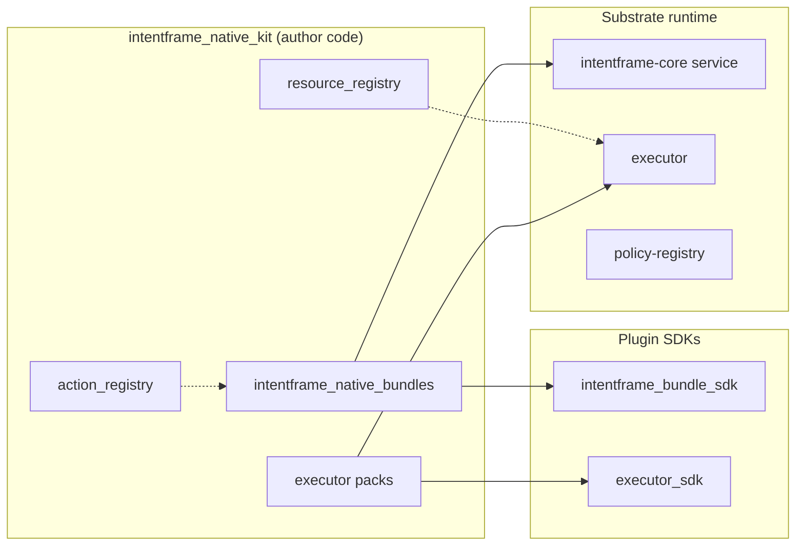

# IntentFrame Native Kit

**Author / plugin code — not IntentFrame substrate.**

First-party reference for shipping a product on IntentFrame (gateway, CLI, Jarvus-style integrations): action taxonomy, bundles, executor packs, optional workspace service, and YAML profiles. A minimal substrate deployment does not require this tree.

A third-party team can replace the entire kit with their own packages—action ids, constraints, adapters, profiles—without changing substrate (`intentframe_server`, `intentframe_components`, `executor/`) or the plugin SDKs (`intentframe_bundle_sdk`, `executor_sdk`).

| Layer | Role |
|-------|------|
| **Substrate** | Pipeline, policy registry, executor host; must not import this kit |
| **Plugin SDKs** | `intentframe_bundle_sdk`, `executor_sdk` — author-facing contracts |
| **Native kit** (here) | First-party plugins + taxonomy + profiles |
| **Your product** | Agents, UX, credentials, chosen profiles |

Docs: [`intentframe_bundle_sdk/README.md`](../intentframe_bundle_sdk/README.md), [`docs/plugin-profiles.md`](../docs/plugin-profiles.md), [`docs/processes.md`](../docs/processes.md).

---

## Import boundaries (kit code)

Kit Python code must **not** import `intentframe_core` directly. Wire types come through the SDKs:

| Kit area | Import wire types from |
|----------|-------------------------|
| `intentframe_native_bundles/`, `action_registry/` (domain schemas), `resource_registry/` | `intentframe_bundle_sdk` — e.g. `IntentFrame`, `DomainSchema`, `owner_home`, `normalize_virtual_path` |
| `intentframe_executor_pack_*` | `executor_sdk` for pack-only helpers (e.g. `owner_home`); submodules under `executor_sdk.*` for adapters/models |

```python
# bundle / registry author style
from intentframe_bundle_sdk import ActionBundle, IntentFrame, DomainSchema

# executor pack author style
from executor_sdk import owner_home
from executor_sdk.adapters import register_adapter
```

CI: `tests/test_native_kit_boundary_imports.py`. Third-party plugin packages should follow the same rule—only the SDKs, not `intentframe_core`.

**Inside the kit:** `action_registry` is kit-local vocabulary (optional for agents); bundles and packs may import it. Substrate and `intentframe_core` stay unaware of it.

---

## What is in this folder

```
intentframe_native_kit/
  action_registry/              Action vocabulary (ActionType, catalog, domain schemas)
  resource_registry/            Optional workspace mounts + client/executor views
  intentframe_native_bundles/   Action + domain bundles (register_bundles)
  intentframe_executor_pack_posix/   Base pack: transport, auth, storage, files
  intentframe_executor_pack_macos/   macOS adapters + Seatbelt sandbox
  intentframe_executor_pack_console/ Console user_io (headless / CI)
  core.yaml                     First-party core profile (bundles list)
  supervisor_profile.yaml       Opt-in graph (+ resource-registry)
  edge_profile.yaml             Opt-in edge (+ /workspaces)
```

### `action_registry/`

Shared action vocabulary: `ActionType`, categories, `ActionCatalog`, domain intent schemas under `domains/`. Used for consistent action ids across bundles, packs, and policy YAML. Optional for agent authors (fail-fast before `Actor.submit()`).

The pipeline treats `IntentFrame.action` as an opaque string; substrate does not import this package.

### `resource_registry/`

Optional workspace service: virtual→real mounts, `ClientView` / `ExecutorView`. Gateway and test stacks enable it via kit supervisor + edge profiles. Static `pack_options.files.mounts` in `executor.yaml` is enough when workspaces never change.

### `intentframe_native_bundles/`

First-party action and domain plugins. Entry: `intentframe_native_bundles:register_bundles` (listed in `core.yaml`).

Families: terminal, files, host_files, email, browser, calendar, clipboard, contacts, messages, notes, reminders, spotlight, system, user_io, api; domains: deletion, finance; shared helpers under `shared/`.

### Executor packs

Loaded by `executor` from `executor.yaml` `packs:` (transport, auth, storage, adapters).

| Pack | Role |
|------|------|
| `intentframe_executor_pack_posix` | Portable base: UDS, HMAC, SQLite audit/state, VFS files adapter |
| `intentframe_executor_pack_macos` | macOS native adapters + terminal sandbox |
| `intentframe_executor_pack_console` | Console `user_io` |

Entry points: `intentframe.executor_packs` (`posix`, `macos`, `console`). Sandbox: [`intentframe_executor_pack_macos/sandbox.md`](intentframe_executor_pack_macos/sandbox.md).

### Profiles (YAML)

| File | Purpose |
|------|---------|
| `core.yaml` | `INTENTFRAME_CORE_CONFIG` — which bundles core loads |
| `supervisor_profile.yaml` | Adds `resource-registry` to the supervisor graph |
| `edge_profile.yaml` | Exposes `/workspaces` (pair with supervisor kit profile) |

```bash
export INTENTFRAME_CORE_CONFIG=intentframe_native_kit/core.yaml
export INTENTFRAME_SUPERVISOR_CONFIG=intentframe_native_kit/supervisor_profile.yaml
export INTENTFRAME_EDGE_CONFIG=intentframe_native_kit/edge_profile.yaml
```

Deploy: [`deploy/dev/README.md`](../deploy/dev/README.md).

---

## How the pieces fit together



1. Core loads bundles from `core.yaml` (`ensure_loaded` → `register_bundles`).
2. Executor loads packs from `executor.yaml`.
3. Bundles/registries use `intentframe_bundle_sdk` for wire types; packs use `executor_sdk`.
4. `action_registry` is kit-local shared vocabulary.
5. `resource-registry` is optional; static executor mounts work without it.

---

## Replacing or forking the kit

- Ship your own `core.yaml` + bundle package and `executor.yaml` + packs.
- Optionally ship your own workspace service—or omit it.
- Point `INTENTFRAME_*_CONFIG` at your profiles; substrate will not import `intentframe_native_kit` unless you list your modules in those profiles.

Jarvus and similar products own their profiles and plugin packages; this kit is one complete example, not a platform requirement.
